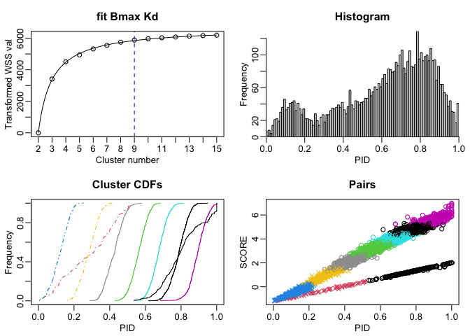
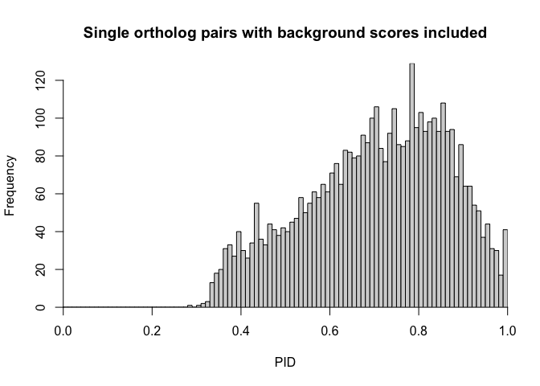

# SynExtend – a work in progress!

As this is a simple workflow, there’s not much dependencies here.

``` r
suppressMessages(library(SynExtend))
suppressMessages(library(RSQLite))
```

## Data Collection

``` r
ftps <- c("https://ftp.ncbi.nlm.nih.gov/genomes/all/GCF/948/472/415/GCF_948472415.1_JK4103/",
          "https://ftp.ncbi.nlm.nih.gov/genomes/all/GCF/036/010/405/GCF_036010405.1_ASM3601040v1/")

adds <- mapply(SIMPLIFY = TRUE,
               USE.NAMES = FALSE,
               FUN = function(x, y) {
                 paste0(x,
                        "/",
                        y[10],
                        c("_genomic.fna.gz",
                          "_genomic.gff.gz",
                          "_protein.faa.gz"))
               },
               x = ftps,
               y = strsplit(x = ftps,
                            split = "/",
                            fixed = TRUE))
fnas <- adds[1, ]
gffs <- adds[2, ]
amns <- adds[3, ]
```

## Data Processing

``` r
dbpath <- tempfile()
conn01 <- dbConnect(SQLite(), dbpath)
genecalls2 <- vector(mode = "list",
                     length = length(gffs))

for (m1 in seq_along(fnas)) {
  Seqs2DB(seqs = fnas[m1],
          type = "FASTA",
          dbFile = conn01,
          identifier = as.character(m1),
          verbose = TRUE)
  genecalls2[[m1]] <- gffToDataFrame(GFF = gffs[m1],
                                     Verbose = TRUE)
}
```

    ## Reading FASTA file chunk 1
    ## 
    ## 3 total sequences in table Seqs.
    ## Time difference of 0.92 secs
    ## 
    ## ================================================================================
    ## Time difference of 1.323431 mins
    ## Reading FASTA file chunk 1
    ## 
    ## Added 1 new sequence to table Seqs.
    ## 4 total sequences in table Seqs.
    ## Time difference of 1.02 secs
    ## 
    ## ================================================================================
    ## Time difference of 1.521185 mins

``` r
names(genecalls2) <- seq(length(genecalls2))
```

## Initial pipeline steps

``` r
syn <- FindSynteny(dbFile = conn01,
                   verbose = TRUE)
```

    ## ================================================================================
    ## 
    ## Time difference of 61.74 secs

``` r
l01 <- NucleotideOverlap(SyntenyObject = syn,
                         GeneCalls = genecalls2,
                         Verbose = TRUE)
```

    ## 
    ## Reconciling genecalls.
    ## ================================================================================
    ## Finding connected features.
    ## ================================================================================
    ## Time difference of 0.4725101 secs

``` r
PrepareSeqs(SynExtendObject = l01,
            DataBase01 = conn01,
            Verbose = TRUE)
```

    ## Preparing overhead data.
    ## ================================================================================
    ## Complete!
    ## Time difference of 1.649381 secs

## Inferrence evaluation steps

``` r
p01 <- SummarizePairs(SynExtendObject = l01,
                      DataBase01 = conn01,
                      Verbose = TRUE,
                      IndexParams = list("K" = 5))
```

    ## Collecting pairs.
    ## ================================================================================
    ## Time difference of 1.423786 mins

``` r
p02 <- ClusterByK(SynExtendObject = p01,
                  Verbose = TRUE,
                  ShowPlot = TRUE)
```

    ## ================================================================================

<!-- -->

    ## Time difference of 2.559679 secs

``` r
p03 <- CompetePairs(SynExtendObject = p02[p02$ClusterID %in% which(attr(x = p02,
                                                                        which = "Retain")), ],
                    Verbose = TRUE,
                    PollContext = TRUE)
```

    ## ================================================================================
    ## Time difference of 0.5909169 secs

## Some plots

``` r
hist(x = p03$PID,
     breaks = seq(from = 0,
                  by = 0.01,
                  to = 1),
     xaxs = "i",
     yaxs = "i",
     main = "Single ortholog pairs with background scores included",
     xlab = "PID")
```

<!-- -->

## Final thoughts

SynExtend has been a bit of a meandering project. Part of the reason for
it living in the research doldrums for so long is that there aren’t
particularly good methods for benchmarking orthology inference,
particularly in the space where this tool is intended for use. The goal
here was to build a backbone of orthology inference for use with
prokaryotic genomic data at the scale of genbank. This site and these
examples are still under construction.
